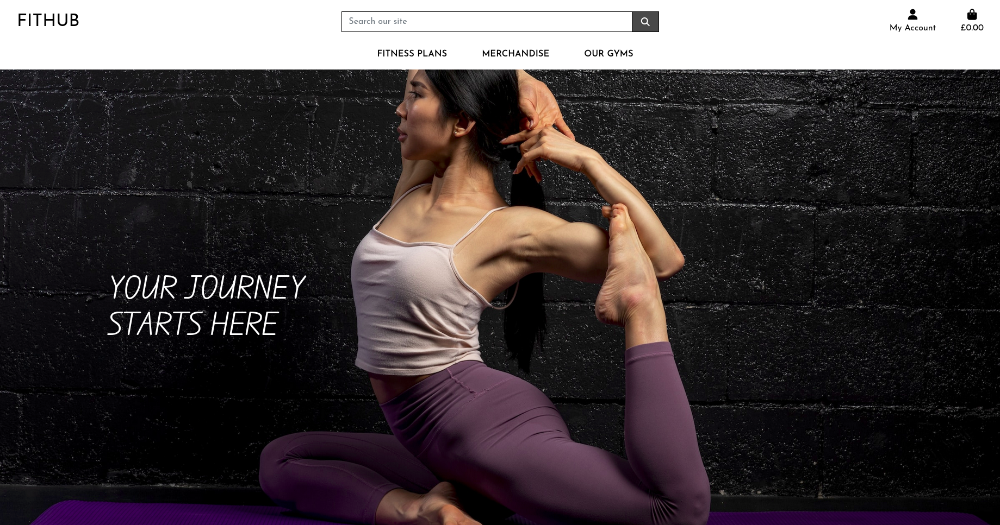
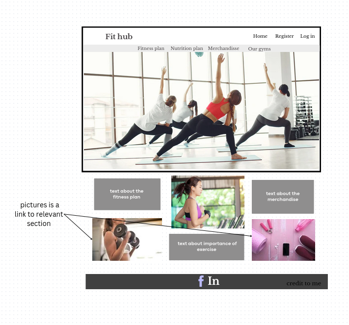
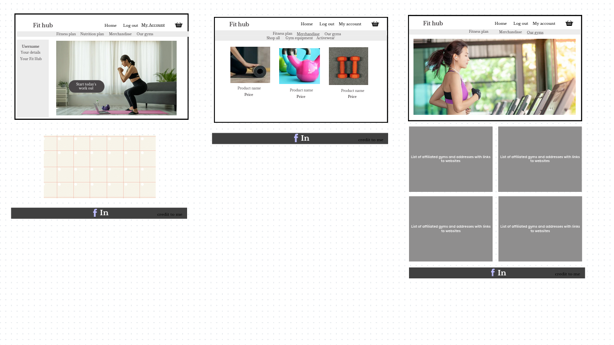
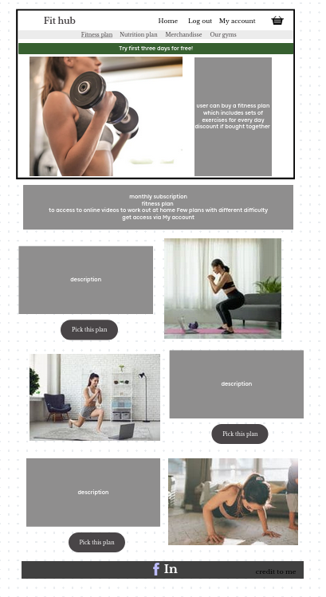
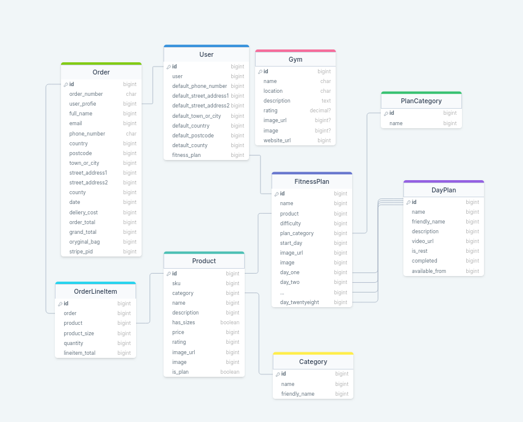
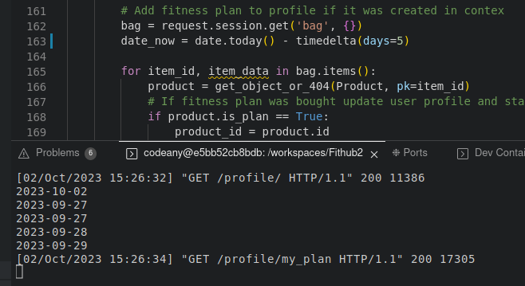

## Code Institute Milestone Project 4

# Fithub




## UI/UX

### Project goals

Fithub is a fictitious website combining e-commerce and fitness.
The goal is to create a brand that is recognisable in all aspects of fitness (merchandise, gyms and 'on demand' fitness plans).
On Fithub page users can but fitness related aparell and equipment as well as fitness plan they can follow. Website also contains a section dedicated to locating Fithub gyms.

### User Stories

As a User I would like to:

- Browse merchandise
- Buy merchandise
- Buy gym equipment
- Create a profile to allow me to check out quicker in the future
- Buy a frtness plan I can follow at home
- Follow fitness plan and mark my progress on the page
- Find a gym I could go to

### Page owner goals

As an owner of this page I would like to:

- be able to add new merchandise to the website
- be able to edit merchandise
- be able to delete merchandise
- be able to add new fitness plans to the website
- be able to edit fitness plans
- be able to delete fitness plans
- be able to add new gyms to the website
- be able to edit gyms
- be able to delete gyms

### Developer goals

Allow users to easily:

- register to the website
- log in to the website
- navigate through the site
- find items they want to buy
- be able to adjust quantity and sizes of the items
- check out safely
- find a fitness plan that suits them
- follow fitness plan by checking off each completed day
- find nearest gyms they could go to


## Design

### Wireframes

The wireframes for desktop view were developed first then mobile view and responsiveness was being checked while working on the project.








### Fonts

Font awesome was used to generate icons. They are present on many of the buttons.
Google fonts Josefin Sans was used as a basic font on the page and Edu QLD Beginner for the text over the hero image.

### Colour scheme

Main body of the page is kept in grey colours with few purple elements which harmonise withe the hero image. 
It creates a soft background to many product images which are not limited to any colur restroctions. 
Toasts and warnings have appropriate colours eg. text warning the card will be charged. 
Thanks to the gray base the page is not too visually overhelming. 


## Defensive design

Sites which should be available only for the superuser or legged in users are guarded by either or :

```
    if not request.user.is_superuser:
        messages.error(request, 'Sorry, only store owners can do that.')
        return redirect(reverse('home'))
```
```
    @login_required
```

### Adresses Checked

results:
HP - Sent to home page
404
STL - Sent to log in page

| address | user not logged in | not superuser |
| --- | --- | --- |
| merchandise/add | STL | HP |
| gyms/add | STL | HP |
| plans/days | STL | HP |
| gyms/edit/1/ | STL | HP |
| gyms/delete/1/ | STL | HP |
| plans/edit/1/ | STL | HP |
| plans/editday/2/ | STL | HP |
| merchandise/edit/2/ | STL | HP |
| profile/management/add_plan | 404 | HP |
| profile/management/add_day | 404 | HP |
| profile/management/add_fitness_category | 404 | HP |
| plans/editctegory | 404 | HP |
| profile | STL | Yes as it should |
| merchandise | yes | yes |

Ideally user would not be sent to 404 so that needs to be fixed.
Also Merchandise contains all the merchandise including fitness plans which do ot show on merchandise page accesed form the menu, however there is no harm in access but could be fixed.


## Features

#### When not logged in

Navigation
Navigation bar consists of a logo which also serves as a link to the main page, search bar with all the functionality, My account which gives option to register and lig in and bag. Bag can be accesed regardles if the user is logged in ot not.
User accounts are handled by allauth.

On the top menu
Merchandise, Fitness plans and Gyms.
Merchandise can be browsed and added to the bag.
Fitness plan can be viewed but cannot be added to the bag as it would need a user profile to attach to.

Bag can be adjusted and checkout completed.

#### When logged in

On top of all that guest users can do, logged in users can:
Purchase a fitness plan, view it and followon the profile page
Access and adjust their info either on the profile page or dutrng check out
View their past orders
As they are logged in they can also log out

#### Superuser

On top of all that logged in regular users can do, superusers can also perform crud operations on merchandise, plans, gyms and categories in the product management page available either through profile or menu.

### Information Architecture

Schema:



## Technologies and resources used

- Languages:

- HTML Used to create the structure of websites
- CSS Used to add style to the website
- JavaScript Used to activate dynamic elements
- Python  Used to create and run the web application
- Markdown for Readme file

- Websites

- Google Chrome Developer Tools - Used to test the responsiveness of the site
- Firefox Developer Tools - Used to test the responsiveness of the site
- Font Awesome - Used to source icons
- Canva - Used to create wireframes and logo
- Pixabay - Used to source images
- Github - GitHub for versionn control for the development of application up to deployment
- CodeAnywhere -An online IDE used to build and develop the website
- Heroku- The cloud platform used to host the deployed site
- Slack - Used during development and testing to find the solutions for the encountered problems
- Stack Overflow - Used to search for the answers to encountered problems
- Code Institute - Used to review concepts covered in preceding modules and walk-through projects
- RandomKeyGen - Used to generate the Secret Key
- W3C CSS Validation Service - Used to validate the CSS code
- W3C HTML Validation Service - Used to validate the HTML code
- ElephantSQL - PostgreSQL database hosting service
- Youtube - links for videos for fitness workout
- Bootstrap - Used to add various structures and styles to the website
- Dave's Gym in Cardiff used as a gym link to demonstrate it works
- drawsql.app - drawing schema
- Django-allauth - authentication and authorisation
- Djngo - web framework
- Temp Mail - temporary email address


### Testing

| Action | User not logged in | User logged in | Superuser | Pass |
| --- | --- | --- | --- | --- |
|  Can register | Option available when clicking on the peron icon in the header nav. Email sent to the user and can be confirmed.  | Option not avaiable | Option not avaiable | Yes |
| Registering with email or username that has been already used | Account not created 'email/username already exists' information provided.  | Option not avaiable | Option not avaiable | Yes |
| Registering with noncompliant password | Adequate feedback provided 'This password is too short. It must contain at least 8 characters. This password is too common. This password is entirely numeric.' | Option not avaiable | Option not avaiable | Yes |
| Login | User needs to be registered to be able to log in | Option available when clicking on the person icon in the header nav. | Option available when clicking on the peron icon in the header nav. | Yes but: Success message shows basked content. It could be fixed or left as it reminds the user that they have an unfinished shopping and might prompt them to check out. |
| Log out | Option not avaiable | Option available when clicking on the peron icon in the header nav. Sign out confirmation then requested. Sign out successful. | Option available when clicking on the peron icon in the header nav. Sign out confirmation then requested. Sign out successful. | Yes |
| Clicking on the Fithub logo | Takes user to the main page checked from fitness plans, merchandise and gym page. | Tested on mobile view where logo is not visible | <- The same checked also from profile and management page | Yes |
| Clicking shopping bag icon when it is empty | Shopping bag page with 'Your bag is empty.' message and keep shopping button which takes us to merchangise page |  <- The same  | <- The same  | Yes |
| Clicking shopping bag icon when something is in it | Shoping bag page with all the contents as should be | <- The same   |  <- The same  | Yes  |
|  |  |  |  |  |
| Fitness plans | Page shows fitness plans |  <- The same  | <- The same |  Yes |
| Clickin on a Fitness plan | Fitness plan page shows | <- The same   |  <- The same | Yes  |
| Clicking Try Now button | Day plan page shows | <- The same   | <- The same |  Yes |
| Clicking to open the youtube video | Opens the youtube video in a new tab | <- The same | <- The same |  Yes |
| Clicking workout complete | Takes us back to the day fitness page |  <- The same | <- The same |  Yes |
| Clicking add to bag when we don't have a plan yet | 'You have to be logged in to purchase a fitness plan' message shows | Adds fitness plan to the bag | <- The same | Yes |
| Clicking add to bag when we do have a plan | N/A | Not possible to add a plan | <- The same |  Yes |
| Clicking add to bag when we do have a plan in a bag already | N/A | Not possible to add a plan | <- The same |  Yes |
| Fitness plan in the bag | N/A | Only adjustment button showing is remove as we cannot have more than one fitness plan at the time | <- The same | Yes |
| Remove fitness plan from the bag | N/A | Fitness plan gets removed. We go tho the merchandise page | <- The same | BUG ideally we would got to the plans page |
|  |  |  |  |  |
| All Merchandise | We go to the merchandise page | <- The same  | <- The same |  Yes |
| Workout equipment | We go to the merchandise page with Workout equipment showing | <- The same  | <- The same | Yes  |
| Activeware | We go to the merchandise page with Activeware showing |  <- The same | <- The same |  Yes |
| Click see all products | Merchandise page shows both workout equiplent and activeware |  <- The same |  <- The same | Yes  |
| Click Activeware under a product price | Merchandise page shows activeware |  <- The same | <- The same | Yes  |
| Click Workout equipment under a product price | Merchandise page shows workout equiplent |  <- The same | <- The same |  Yes |
| Sort by various paramters |Products are mostly srted accordingly. No rating shows as the highest rating |  <- The same | <- The same | sorting BUG could be fixed easy to spot with few products but might be annoying with a lot of unrated products pushing to the front |
| Click on a product | Product page opens |  <- The same |  <- The same | Yes  |
| Adjust quantity by buttons, arrows or input| Quantity adjusted |  <- The same |  <- The same | Yes  |
| Attempt to go below 0 with buttons | Quantity does not go below zero |  <- The same |  <- The same | Yes  |
| Attempt to go over 99 with buttons | Quantity does not go over unless adjusted by input | <- The same  | <- The same  |  Yes |
| Add product with quantity over 99 by manual input | 'Please select value that is no more than 99' message appears and item not added to the bag | <- The same  | <- The same  | Yes |
| Add product with quantity below 0 by manual input | 'Please select value that is no less than 0' message appears and item not added to the bag |  <- The same | <- The same  | Yes  |
| Click keep shopping on the item page| We go back to the merchandise page and nothing is added to the basket |  <- The same | <- The same |  Yes |
| Item size showing and can be picked | Only for the items with sizes | <- The same  |  <- The same |  Yes |
| Add item to the bag | Item added to the bag with correct(picked by us) size and quantity. Success toast is showing with picture and item description. Button to checkout showing | <- The same  | <- The same | Yes  |
| Add item to the bag when one is already in | Item added to the bag with correct size, quantity adjusted. Success toast is showing with picture and item description. Button to checkout showing | <- The same  | <- The same | Yes  |
| Add item to the bag when one is already in vut different size| Item added to the bag with correct sizes and quantities. Success toast is showing with picture and item description. Button to checkout showing | <- The same  | <- The same | Yes  |
| Click checkout button from the toast | Going to the shopping bag. It is not check page out yet but this way we can confirm on a full screenthat all is ok with our order | <- The same  | <- The same |  Yes |
| Click product category on the product page | We go back to the merchandise page with only relevant category showing |  <- The same | <- The same |  Yes |
| In bag adjust item quantity by buttons, arrows or input| Quantity adjusted |  <- The same | <- The same  | Yes  |
| In bag attempt to go below 0 | Quantity can go below if input manually. Item gets removed. Could be guarded but does not break the page and king of makes the sense | <- The same  |  <- The same | Could be better but does not break the page. Will be fixed in the future |
| In bag attempt to go over 99 | Quantity can go over if input manually | <- The same  |  <- The same | BUG, needs to be fixed |
| In bag remove item | Item removed |  <- The same |  <- The same | Yes  |
| Subtotal of items | Calculated acordingly and showing | <- The same | <- The same | Yes |
| Grand total | Calculated accordingly. Shows how much more for the delivery. | <- The same and fitness plan in the bag takes delivery to zero | <- The same | Yes |
| Secure checkout button on bag page | Takes us to the form | <- The same but the form is prefilled, information changed save in the profile if we choose to  | <- The Same | Yes |
| Adjust Bag on checkout page | Takes us back to the bag | <- The Same | <- The Same | Yes |
| On order page more shopping button | Takes us to the merchandise page | <- The Same | <- The Same | Yes |
| Create the account link on the check out page | Takes us to the log in page | N/A | N/A | Yes |
| Log in link on the check out page | Takes us to the log in page | N/A | N/A | Yes |
| Processing payment | Checks out, payment taken by stripe, webhook created | <- The same and order shows on my orders page | <- The same  | Yes |
|  |  |  |  |  |
| Gyms page | Shows all the gyms | <- The same  | <- The same | Yes  |
| Clicking on the gym name | Gym page opens on a new tab |  <- The same | <- The same | Yes  |
|  |  |  |  |  |
| My Profile | N/A | Accesible through person icon in the top right corner | <- The same | Yes |
| My info on profile page | N/A | info can be updated | <- The same | Yes |
| My Fitness plan | N/A | Showing our instance plan details if purchased, button to all fitness plans if not | <- The same | Yes |
| My orders | N/A | Shows past orders list | <- The same | Yes |
| Clicking on the order in my orders | N/A | Shows us order details with informtions adjusted so it is clear it is a past order | <- The same | Yes |
| Go back to the profile from past order page | N/A | takes us back to the profile | <- The same | Yes |
|  |  |  |  |  |
| Product management | Cannot access | Cannot access | Accesible from the navigation and profile for the superuser only | Yes |
| Links on the management page | N/A | N/A | Go to correct forms/ pages - checked one by one | Yes |
| Add Product form | N/A | N/A | Product cannot be added without required fields filled in but price can be zero minus. Product can be added with rating over 5.00 | Possible BUG with the pricing as it is a function accesed only by the store owner it is for them to decide if that functionality can be somehow used or it needs to be changed. BUG Rating field needs to be adjusted |
| Add Fitness plan | N/A | N/A | Cannot be added without required fields filled | Yes |
| Add Fitness day | N/A | N/A | Cannot be added without required fields filled | Yes |
| Add Fitness category | N/A | N/A | Cannot be added without required fields filled | Yes |
| Add Gym  | N/A | N/A | Cannot be added without required fields filled | Yes |
| Edit Product form | N/A | N/A | Same rules and BUGs as with adding a product | Same as adding the product |
| Cancel editing Product | N/A | N/A | Goes back to all product with product unchnged | Yes |
| Delete Product | N/A | N/A | Product deleted we go back to all products| Yes |
| Edit Fitness plan | N/A | N/A | Cannot be edited without required fields filled. When edited goes to the fitness plan details page | Yes |
| Cancel editing Fitness plan | N/A | N/A | Goes back to all fitness plans | Yes |
| Delete Fitness plan | N/A | N/A | Deleted and goes back to all fitness plans | Yes |
| Edit Fitness day | N/A | N/A | Cannot be edited without required fields filled | Yes |
| Cancel editing Fitness day | N/A | N/A | Goes back to all fitness days | Yes |
| Delete Fitness day | N/A | N/A | Deleted and goes back to all fitness days | Yes |
| Edit Fitness category | N/A | N/A | Can be acccesed from the all fitness plans page. Cannot be added without required fields filled | Yes |
| Cancel editing Fitness category | N/A | N/A | Can be acccesed from the all fitness plans page. Goes back to all fitness plans | Yes |
| Delete Fitness category | N/A | N/A | Can be acccesed from the all fitness plans page. Deleted and goes back to all fitness plans | Yes |
| Edit Gym  | N/A | N/A | Cannot be added without required fields filled | Yes |
| Cancel editing gym | N/A | N/A | Goes back to all gyms | Yes |
| Delete gym  | N/A | N/A | Deleted and goes back to gyms | Yes |
|  |  |  |  |  |
| Toasts showing | When items added, adjusted or removed toasts show as expected | <- The same  | <- The same  | Some of the items shoud get friendly name to show on toasts |

The mechanics of the fitness plan was tested by adjusting view to set earlier start-day. Current date, start_day, day_one.available_from, day_two.available_from, day_three.available_from were printed to the console to check if logic works. Fitness workout was available only on the days for which available_from date was equal or past today's date. Mechanics to check off each day as done after the workout needs to be added although user would have access to the previous workouts either. 



### Bugs


#### Solved

When performing CRUD operations toast would show contents of the bag. 
Toast type was chaneged to info and it's headline adjusted.

#### Unfixed bugs that are important to fix

The management - Management shoud have been put in a separate app.
Splitting it between different apps creates inconsistencies and makes the other apps less transparent.

Mechanics to check off each day as done after the workout needs to be added. It's lack, however, does not break the mechanics. 

Unregistered user is sometimes being ssent to page 404 when trying to access pages they don't have access to. Ideally needs to be redirected somewhere instead.

Product incrementation buttons on mobile view are stacked. Media quiery needed.

When coming onto page through facebook link delivery banner is slightly covered. It does not happen on a 'regular browser' mobile view. Media quiery needed.

## Deployment Steps

Go to ElephantSQL.com and create and account if you don't have one yet

If you already have an account, after logging in
Set up your plan and copy the database url

Set up Heroku - create or log in to your Heroku account
Click button New then select new app
Add the app name and region
Create the App

In settings add config var ```DATABASE_URL``` and give it value of the your database url from ElephantSQL

In the terminal, install ```dj_database_url``` and ```psycopg2```

Update your requirements.txt file with ```pip freeze > requirements.txt``` command

In the settings.py file put import ```dj_database_url``` underneath the ```import os```

Update DATABASES section to:
```
 DATABASES = {
     'default': dj_database_url.parse('your-database-url-here')
 }
 ```

 In the terminal show mirations  ```python3 manage.py showmigrations```

 Migrate ``` python3 manage.py migrate``` and loadcategories remembering to load ones that are foregin keys first
 eg: ``` python3 manage.py loaddata categories``` then ``` python3 manage.py loaddata products```

 Create a superuser  ```python3 manage.py createsuperuser```

 Change the DATABASES section of the settings.py
 ```
  DATABASES = {
     'default': {
         'ENGINE': 'django.db.backends.sqlite3',
         'NAME': os.path.join(BASE_DIR, 'db.sqlite3'),
     }
 }
 ```

In Browser tab on the ElephangSQL page click Table quiries, then pick auth_user and Execute

Change the DATABASES section of the settings.py
```

if 'DATABASE_URL' in os.environ:
    DATABASES = {
        'default': dj_database_url.parse(os.environ.get('DATABASE_URL'))
    }
else:
    DATABASES = {
        'default': {
            'ENGINE': 'django.db.backends.sqlite3',
            'NAME': os.path.join(BASE_DIR, 'db.sqlite3'),
        }
    }
```

Instal gunicorn with ```pip3 install gunicorn``` and freeze with ```pip freeze > requirements.txt```

Create Procfile and ```web: gunicorn boutique_ado.wsgi:application``` to it

Login to Heroku and add variable ```DISABLE_COLLECT_STATIC=1```

Add host name of the heroku app to settings.py ```ALLOWED_HOSTS = ['8000-annasedab-fithub2-wojmqjnwrn.us2.codeanyapp.com']```

Commit the changes, push to github and deploy on the heroku page

In Heroku settings change Deployment method to Github and pick your app in the connect to github section

Enable automatic deploy

Generate a secret key with Django secret key generator or something similar and add it to
 config vars in heroku as SECRET_KEY

Change SECRET_KEY in settings.py to ```SECRET_KEY = os.environ.get('SECRET_KEY', '')``` and DEBUG to ```DEBUG = 'DEVELOPMENT' in os.environ```

Then commit and push to github

Create AWS account or log in if you already have one

Fins S3 in AWS services and create new bucket - choose region closest to you and uncheck block all public access

Access buckets Properties tab then in Static website hosting -> Use this bucket to host a website then input index.html and error.html and save

In Permissions tab -> CORS Configuration paste
```
[
{"AllowedHeaders": [
"Authorization"
],
"AllowedMethods": [
"GET"
],
"AllowedOrigins": [
"*"
],
"ExposeHeaders": []
}
]
```

Still in Permissions tab -> Bucket policy -> Policy generator
Type of policy ```S3 Bucket policy```
Principal ```*```
Action ```get_object```
Copy in ARN from the previous tab
Click Add statement -> generete policy
Copy the policy and paste into the Cucket policy editor
Add ```/*``` at the end of Resource line
```
{
    "Version": "2012-10-17",
    "Id": "Policy1696273111023",
    "Statement": [
        {
            "Sid": "Stmt1696273098578",
            "Effect": "Allow",
            "Principal": "*",
            "Action": "s3:GetObject",
            "Resource": "arn:aws:s3:::fithubv2/*"
        }
    ]
}
```

In Access control list (ACL) section, click edit and enable List for Everyone (public access) then accept the warning box

Find IAM in AWS services

Click Groups then Create new Group and call it what you want as long as it makes sense to you

Click policies then Create Policy
Go to JSON tab then click import managed policy and import ```AmazonS3FullAccess```
add your arn and arn/* to resource
```
{
    "Version": "2012-10-17",
    "Statement": [
        {
            "Effect": "Allow",
            "Action": [
                "s3:*",
                "s3-object-lambda:*"
            ],
            "Resource": [
                "arn:aws:s3:::fithubv2",
                "arn:aws:s3:::fithubv2/*"
            ]
        }
    ]
}
```
Click Review policy and give it a name and a description
Click Create Policy

On Groups page pick the one we created in the previous steps -> Permisions -> Attach policy
Then select the policy we just created

On Users page click Add user give it a username and click Next then put him in our created group

To download CSV file
IAM and select 'Users' -> select the correct user -> Security Credentials -> Access Keys - click Create new access key -> 'Application running outside AWS'
Leave 'Description tag value' blank and click 'Create Access Key'
Click the 'Download .csv file' 

in terminal intal ```pip3 install boto3``` and ```pip3 install django-storages```
then freeze the requirements.txt

in settings.py add ``` 'storages', ``` to installed apps 
then 
```
if 'USE_AWS' in os.environ:
    # Bucket Config
    AWS_STORAGE_BUCKET_NAME = 'fithubv2'
    AWS_S3_REGION_NAME = 'eu-west-2'
    AWS_ACCESS_KEY_ID = os.environ.get('AWS_ACCESS_KEY_ID')
    AWS_SECRET_ACCESS_KEY = os.environ.get('AWS_SECRET_ACCESS_KEY')
    AWS_S3_CUSTOM_DOMAIN = f'{AWS_STORAGE_BUCKET_NAME}.s3.amazonaws.com'
```

Add AWS_ACCESS_KEY_ID and AWS_SECRET_ACCESS_KEY to Heroku config vars from our downloaded CVS file
Add USE_AWS=True

Create custom_storages.py file and put the below code in it
```
from django.conf import settings
from storages.backends.s3boto3 import S3Boto3Storage


class StaticStorage(S3Boto3Storage):
    location = settings.STATICFILES_LOCATION


class MediaStorage(S3Boto3Storage):
    location = settings.MEDIAFILES_LOCATION
```

Add below code within ``` if 'USE_AWS' ``` statement under #Bucket config
```    
    # Static and media files
    STATICFILES_STORAGE = 'custom_storages.StaticStorage'
    STATICFILES_LOCATION = 'static'
    DEFAULT_FILE_STORAGE = 'custom_storages.MediaStorage'
    MEDIAFILES_LOCATION = 'media'

    # Override static and media URLs in production
    STATIC_URL = f'https://{AWS_S3_CUSTOM_DOMAIN}/{STATICFILES_LOCATION}/'
    MEDIA_URL = f'https://{AWS_S3_CUSTOM_DOMAIN}/{MEDIAFILES_LOCATION}/'
```

Freeze the reqirements.txt and commit and push all changes

Static folder should have been added to the AWS bucket
It can be also added manually 

Add below code within ``` if 'USE_AWS' ``` statement above #Bucket config
```
    # Cache control
    AWS_S3_OBJECT_PARAMETERS = {
        'Expires': 'Thu, 31 Dec 2099 20:00:00 GMT',
        'CacheControl': 'max-age=94608000',
    }
```

commit and push all changes

In AWS S3 create a new folder called media and upload media files to it

Add Heroku config vars 
STRIPE_PUBLIC_KEY 
STRIPE_SECRET_KEY
Creat new webhook for  https://fithubv2-fe0911af64c8.herokuapp.com/checkout/wh/ and add its STRIPE_WH_SECRET


## Cloning the Github repository

Logg in to the Github

Select the repository

Click on the **Code** button located next to the green Gitpod button

Copy link form the HTTPS section

Open terminal

Change the current working directory to the location where you want the cloned directory

Type "git clone" and the previously copier URL

Press **Enter** 

## Forking the Github repository

Logg in to the Github

Select repository you want to fork

Click on the **Fork** button located on the right top section of the page

The copy of oryginal repository is made into your Github account


#Credits

This project is based on the Butique Ado - Code Institute walk through project. Additional apps and functionality was added to show my understanding of the concepts and ability to build code on my own. 

Fellow students and Code Institute persons help and support was used via slack to solve problems encountered on the way.

Stackoverflow was used to research problems. 

Pictures, videos and their desription were taken from the pixabay and youtube and I do not have any commercial rights to them.
